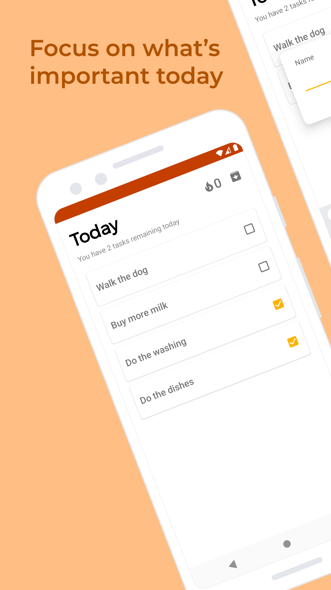
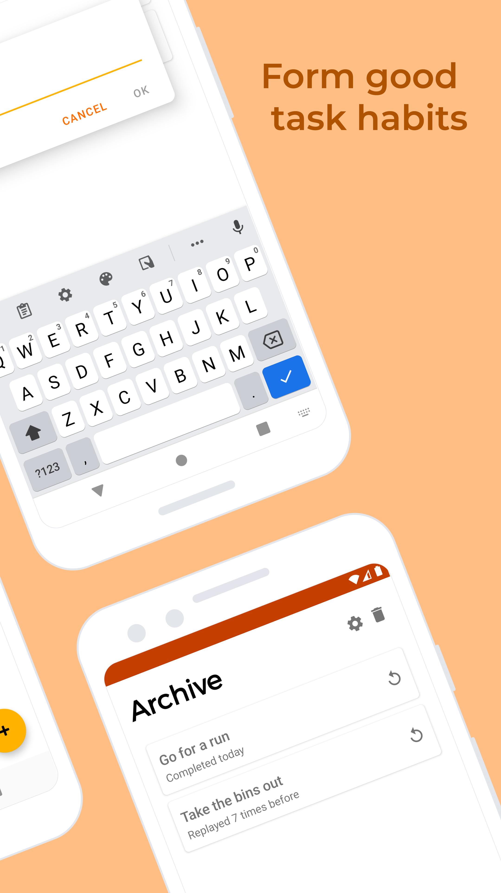

# Sunset 
## By Isaac Young
## Contributors: 
- Isaac Young
- Jamie U
- Reilly Oldham

### Sunset is a simple streak-based task manager for Android
Sunset takes away all the complexity of other to-do apps, and instead focuses only on what you'll do today. Write down your to-do list of what you'll do today and stick to it. Do you everything you wrote down each day and build a streak. 

<b>Only Today</b>

By focusing only on what you'll do today, Sunset declutters your to-do list. What you see is what you do. 

<b>No Deleting</b>

Commit to every task you set out to do. Once you add a task on Sunset, there's no deleting it, so think carefully about what you want to do each day. Either you do it, or you lose your streak. 

<b>Replay</b>
Want to do something every day? Go to the archive page and click the replay icon on any completed task to send it to Today.

## Features
- Adding and checking off tasks

- Streak counter to encourage good habits

- Add task back from archive

  
  
 

